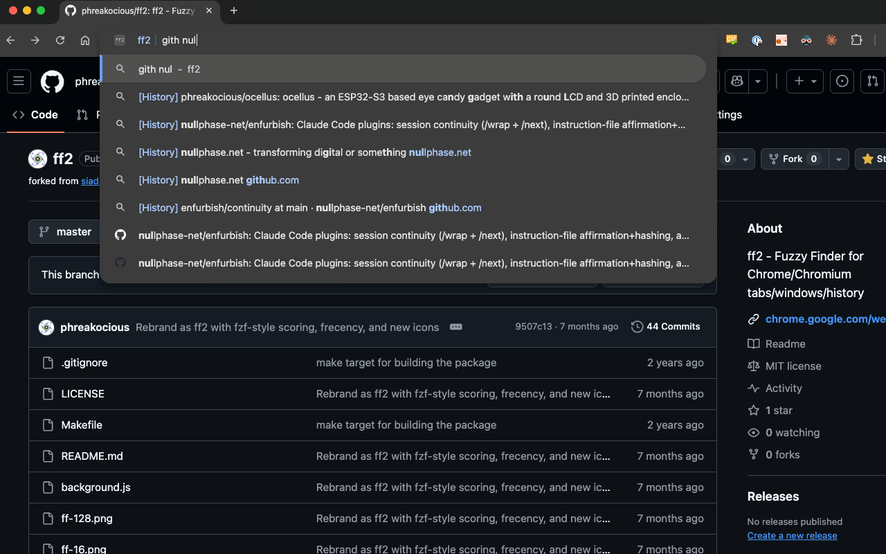

# ff2 — fzf-style tab and history search

`ff` in the address bar, then keywords. Ranks your open tabs and recent history with fzf's scoring, and learns which results you pick.

**Note:** To select the first match, press Enter without arrowing down to a result. With no query at all, Enter jumps to your top-ranked tab.

  

## Features

- **fzf-style fuzzy matching** — the same scoring as fzf: word-start and camelCase matches score higher, contiguous runs earn a bonus, gaps are penalized, and matches that are mostly gap are dropped
- **Frecency learning** — results you pick through ff are ranked higher over time; entries unused for 30 days are forgotten
- **Smart ranking** — combines match quality, how recently a tab was focused or a page visited (exponential decay), visit frequency (log-scaled), and your selection history
- **Tabs first, then history** — searches open tabs across all windows, falls back to browser history (last 90 days)
- **Pinned tab boost** — pinned tabs are always prioritized

## Usage

You have 90 tabs across four windows and you want the one with the conference talk you had open this morning. Type:

    ff talk ytube

Words match in any order, and each matches fuzzily — "ytube" finds "youtube". Word starts and contiguous runs rank higher, gaps cost points; the rules are fzf's. If fewer than five open tabs match, history fills the remaining rows.

## Install

Install from the [Chrome Web Store](https://chromewebstore.google.com/detail/blifadmmfdnmpmdpjfaeccfacfdddiei) or load unpacked from `chrome://extensions/`.

## Development

    make test    # runs test.js under node against a stub chrome API
    make ff2.zip # builds the Web Store package

## Contributing

- Fork and submit a pull request
- [Send a feature request](https://github.com/phreakocious/ff2/issues/new)
- [Report a problem](https://github.com/phreakocious/ff2/issues/new)

## License

This extension is released under the [MIT License](http://www.opensource.org/licenses/MIT).

ff2 is a fork of [siadat/chrome-ff](https://github.com/siadat/chrome-ff) by Sina Siadat.
